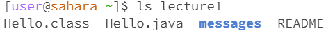

# Lab 1

## CD command
In this first week we learned about different commands that you can use in the terminal. Most of these had to do with interacting with files and directories. The first command we learned was the cd command which is short for "change directory". This allows us to go into a different folder (in a way). This will require an argument which would be the directory that we are switching to. It can be either an absolute or relative path. You can use this command with:
`ls [argument]`

Here's an example of me using this command. I started at the kernel and changed directories to lecture1

Of course, there must be an argument otherwise the directory won't change. ex:

and if there is a file is the argument, you will get a error telling you that the argument is not a directory

## ls command
ls is a command that will list all the contents of a directory. If you don't include an argument, it will return the contents of the current directory

If you include an argument that is also a directory, it will display the contents of that directory

if the argument is a file, it'll just return that file

## cat command
The cat command can be used to open files. When used with a directory as an argument, you will get an error stating that the argument is a directory

When used on a file, it'll open up the file

when used without an argument, the terminal kind of froze, and I was only able to get out with ctrl+c

