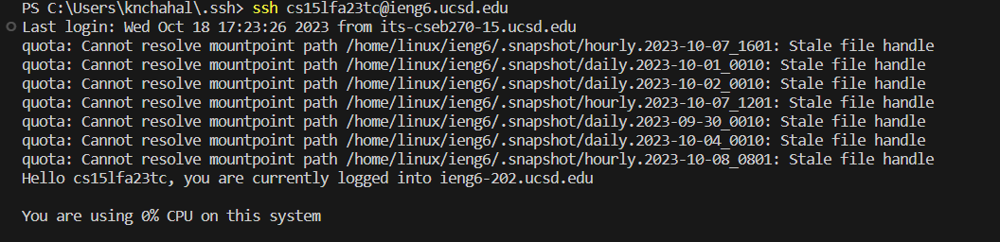

# Lab 2

## Part 1
In this lab I learned a lot more about the web server and I also set up a search engine using the web server tools. Below is the code I have for a page that keeps track of strings.

I used the handle request method a few times to add strings and search for strings from the already added stuff. Here's a couple exampels of me adding strings.

For both of these, the handleRequest method is called with the URL that is typed into the web browser being used as the argument. This means the URI argument is a little different for both calls with one ending in apple and the other ending in ape. When the rest of the code executes some of the other values are also different between these 2 method calls. 
parameters[1] is going to be different since it contains the string that I'm trying to add. Also, the class member variable S is going to a little different after I concatenate it since it is being concatenated with different things. My str variable is going to be a different size since it'll contain an extra element with each call, and the returnString will also be different after 
the final element is added during the final iteration of the for loop.

Although not instructed I also implemented a search feature in the tracker because I didn't read the instructions carefully enough. This uses the same handleRequest() method that I used to add messages, but a different part of the code block executes because it contains the word "search" in the URI. This means that the if block executes instead of the else if block. 
the end of the url is important (specifically paramters[1]), since it tells the computer which substring to look for, and it outputs all the substrings that contain it. This doesn't really change any of the class member variables since it is just searching and doesn't need to change any values.

## Part 2

Using the terminal, it is possible to generate a RSA key pair for encryption. Here is the path to the private key on my local device.

I was also able to make a copy of the public key to the server that I log into with the path shown below.

After doing this, when I try to log into the server, it no longer requires me to type in my password. Instead my login is validates with my private key, since the server can use my copy of the public key saved there to authenticate. Below is a screenshot of me logging in without a password.

## Part 3

Prior to weeks 2 and 3, I knew about public and private keys and have used them a bit for other stuff. I also learned a little bit of the math behind how the key pairs are generated and used in CSE 20. One thing I learned from the last 2 weeks is that I can actually generate my key pair through the terminal, and that the key pairs can be used to connect to server
as a login method.
