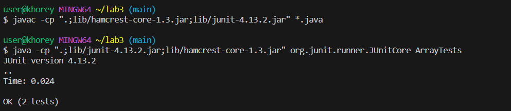
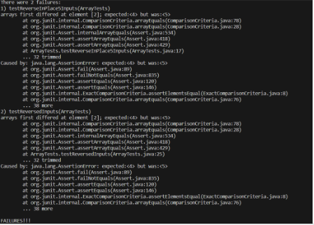

# Lab Report 3

For these past 2 weeks we started learning more about testing, how to write good and thorough tests, and we also learned some more terminal commands.

## Part 1

From week 4, we were given some implementations of code that is used to reverse the elements of an array. This was a buggy implementation that we needed to show through tests and fix. Here's an example of a failure inducing input.

```
public void testReverseInPlace5Inputs() {
    int[] input1 = { 3,4,5,6 };
    int[] input2 = {6,5,4,3};
    ArrayExamples.reverseInPlace(input1);
    assertArrayEquals(input2, input1);
	}
```

Although the code for the implementation is buggy, it doesn't always produce unexpected results. Below is the code for an input that doesn't fail.

```
@Test 
	public void testReverseInPlace() {
    int[] input1 = { 3 };
    ArrayExamples.reverseInPlace(input1);
    assertArrayEquals(new int[]{ 3 }, input1);
	}
```
When I run this test, the code passes:



When you have a failure inducing input, you'll know that the program is failing to produce the expected output from the symptom, which in this case is the output of the JUnit test.



The output next to the "1)" shows the symptom for the failure inducing input that I described above. In order to stop having symptoms and failure inducing inputs, you need to find the bug that's causing it to happen, and fix it. Here's the original code for the buggy method.

```
static void reverseInPlace(int[] arr) {
    for(int i = 0; i < arr.length; i += 1) {
      arr[i] = arr[arr.length - i - 1];
    }
  }
  ```
After I fixed the code, I have:

```
static void reverseInPlace(int[] arr) {

    for(int i = 0; i < arr.length/2; i += 1) {
     // arr[i] = arr[arr.length - i - 1];
      int temp = arr[i];
      arr[i] = arr[arr.length - i - 1];
      arr[arr.length - i - 1] = temp;
    }
  }
```

The old line of code has been commented out. In the original code, but bug exists inside of the for loop. The code only copies the given element's "mirror" (the element that is the same distance from the other end of the array), to each index i. After the for loop goes half-way through the array, it's no longer going to be reversing the array. This is why the code
doesn't fail for arrays with only 1 element. To fix this, I only iterate through half of the array, and make sure to save the overwritten element in a temporary variable, so that I can then copy that over to the mirror element after the original gets overwritten.

## Part 2

All the options that I found come from this [here](https://www.geeksforgeeks.org/find-command-in-linux-with-examples/) . I found this about this website from a google search on this terminal command.

I chose to look into more options with the `find` command. The first interesting option that I found was the `-user` option. This will filter the results of the `find` command to only include stuff that is owned by the user specified after -user. This can be useful if you're using a device that's shared by multiple people, and there's more than 1 copy of the same file,
but owned by different people. It can be useful for finding the copy of a file that's owned by a specific user. To use this command I called `$ find technical/ -user user -size -1k` for my first example, and `$find technical/ -user john` for the seconed example. The first time I called it, the terminal output all the files within `technicals/` since this is the user that the files are saved under:

```
$ find technical/ -user user -size -1k
technical/
technical/911report
technical/biomed
technical/government
technical/government/About_LSC
technical/government/Alcohol_Problems
technical/government/Env_Prot_Agen
technical/government/Gen_Account_Office
technical/government/Media
technical/government/Post_Rate_Comm
technical/plos
```
Note: I put the `-size -1k` option just to restrict the output so I don't get over 1000 lines printed in the terminal. I talk more about this -size options below.

In my second example, I got the output shown below, since this user isn't saved on this device.

```
$ find technical/ -user john
find: ‘john’ is not the name of a known user
```

The second useful option that I found was the -newer command. This will filter the results from `find` to only include files that were created after the file that's passed after -newer was made. In a situtaion like this, where we have a folder of a lot of academic publications, it can useful to search for files newer than a certain file, since you may be searching
for research on a topic that is more recent then whatever file is being passed after -newer. Below I show 2 examples of this command.

```
$ find technical/ -newer ./technical/plos/pmed.0020273.txt
technical/plos
technical/plos/pmed.0020281.txt
```
```
$ find technical/ -newer ./technical/plos/pmed.0020281.txt
```

In the second example, there aren't any files listed since it's the newest file in the directory.

A third useful option I saw was the -empty options. This just returns the files and subdirectories that don't have anything in it. This can be useful if you have a lot of files and subdirectories, and you want to remove all the unnecessary files and subdirectories to make it easier to navigate (assuming it's a context where an empty file or directory is unnecessary). For the first example, I tried using it on a subdirectory in `technicals` and I got:
```
$ find technical/911report/ -empty
```
This returned nothing since there aren't any empty files or subdirectories in here. For the second example, I'm showing what happens if you call it on the 
entire technicals directory:

```
$ find ./technical -empty
```
Even in the entire `technical` there aren't any empty files or subdirectories so it still returned nothing

The last useful option I found was the -size option. This lets you filter the output to only files that are above or below a certain size in kilobytes. This can be useful when you have a lot of files and you want to use one that meets a certain size constraint. Here's a couple examples of it.

```
$ find technical/ -size +300k
technical/government/Gen_Account_Office/d01591sp.txt
technical/government/Gen_Account_Office/Statements_Feb28-1997_volume.txt
```

This filtered all my results to only include files above 300 kilobytes. Next I used it to filter everything below a certain size:
```
$ find technical/ -size -1k
technical/
technical/911report
technical/biomed
technical/government
technical/government/About_LSC
technical/government/Alcohol_Problems
technical/government/Env_Prot_Agen
technical/government/Gen_Account_Office
technical/government/Media
technical/government/Post_Rate_Comm
technical/plos
```
The size constraint I put is very small, so it is no surprise that the only thing returned are the subdirectories.

