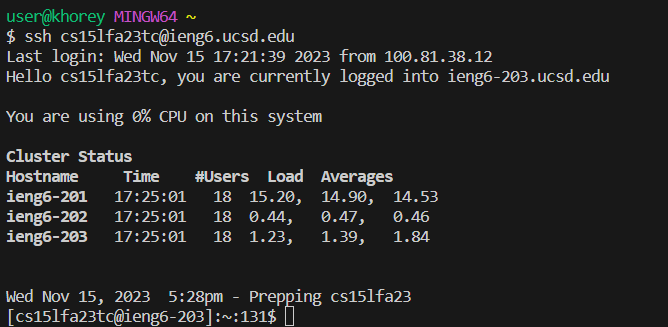
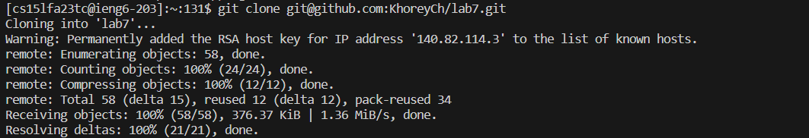
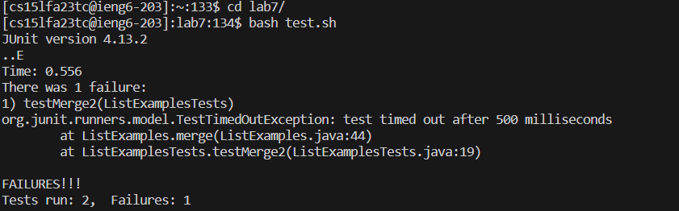
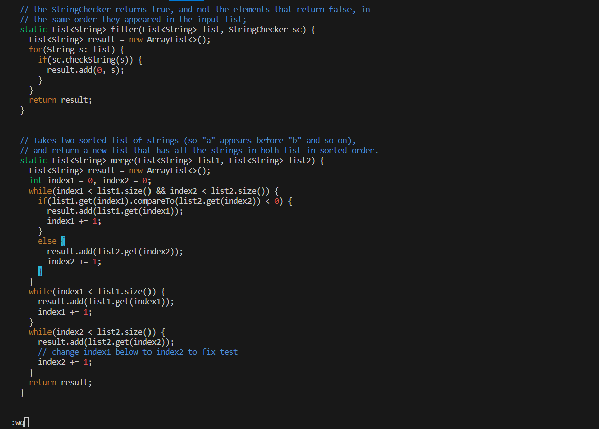
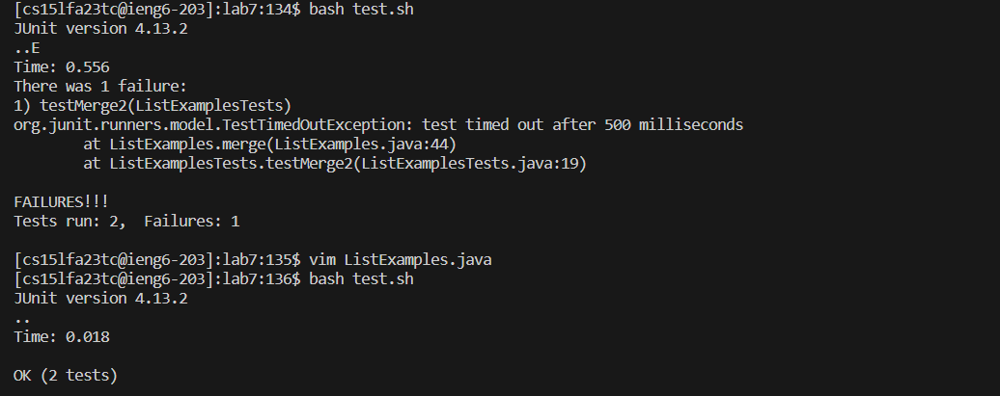
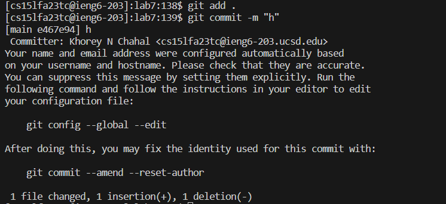

#Lab Report 4 - Vim

In this lab, we learned how to use vim to edit files from the command line, and we learned a lot of shortcuts to making editing go faster. For step 4, I pressed `<Up><Enter>`. This brought up the command: 
`ssh cs15lfa23tc@ieng6.ucsd.edu` because it was the most recent command I used from the terminal. Running this allowed me to connect to the server. Because I have my ssh keys setup, there was no need for me to put in
a password. Here's a screenshot of the result.

For the next step, which happened after I connected to the remote server, I pressed `<ctrl> R cl <Enter>`. This searched the history of the commands I recently used, for whatever had "cl" in it. Doing this brought up
the `git clone git@github.com:KhoreyCh/lab7.git`. This is the to ssh link to the github repository which contains the file that I'm going to edit. The final enter ran the command and cloned the repository

For the next step I needed to demonstrate that there was something wrong with the code by running the junit tests. Thankfully there was a bash script file called test.sh which already runs the tests. So I pressed
`cd l <tab> <Enter> bash t <tab> <Enter>`.  The first part of this command (`cd l <tab> <Enter>`) was used to change directory into the one that contained the test.sh file. The second part (`bash t <tab> <Enter>`)
was used to actually run the tests to demonstrate that it fails.

For Step 7 I pressed `vim L <tab> . <tab> <Enter> ? i <Enter> e r 2 : w q <Enter>`. The first part `vim L <tab> . <tab> <Enter>` was used to open the file in vim. I had to use the `<tab>` twice with a `.` in the
middle because there were 2 files in there that started with "L" so I need to throw in the dot so it knew I was talking about "ListExamples.java". The actual editing happened with the `? i <Enter> e r 2 : wq <Enter>`
The `?` was used to do a search, specifically from the last instance of the match since the typo that needed corrected was at the bottom of the file. I only needed to press the letter "i" for the search result to
bring me to the word that needed to be fixed. I then pressed "e" to jump my cursor to the end of the word since that's specifically where the typo occurred, then I pressed "r2" which basically replaces the character
on my cursor with whatever I put after it. After I do this, the editing is done and do `:wq <Enter>` to save my work and exit vim. 

After this step is complete, I just need to run the tests again to demonstrate that the code is now working properly. To do this I press `<up><up><Enter>`. Since I ran the test.sh file in step 5, I just need to go 
back 2 commands for step 7 to run it again.

After this, everything is done and I just need to push all my changes to the github repository, so I pressed `git add . git commit -m “h”`. The `git add .` puts all the files in the working directory into the 
staging area and the `git commit -m “h”` actually pushes those changes to the repository. the -m command lets me put my message (which I just put "h" for this) right away without needing to go through the extra
menu.

