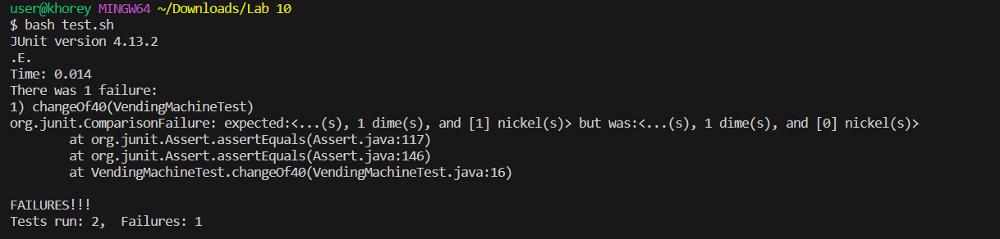

# Part 1

(fake EdStem post)

>I was writing a method that is supposed to mimick a vending machine. The way it this method works is, you input an amount that is the price (which should be a multiple of 5 between 30-100) in cents, and the method
>return a string giving you your change. Your change is calculated assuming you input a dollar, and the string it returns tells you how much quarters, dimes and nickels you get back. For example, if you the method
>takes an input of 35, it'll return "Your change is 2 quarter(s), 1 dime(s), and 1 nickel(s)"
>The problem is that my method isn't passing a test when I give the method an input of 60.
>I'm guessing the bug has something to do with the way I calculate how many quarters, dimes, and nickels the machine is supposed to return, but I'm not entirely sure.



>Here's my code:

```
public class VendingMachine    
{
    public static String changeCalculator(int cost) 
    {
        int quarterChange;
        int dimeChange;
        int nickelChange = 0;
        int change;

        if (cost > 100) 
        {

            return ("Price must be below 100 cents, " +
                                "please give a new value");
           } 
        else if (cost < 30) 
        {
            return ("Price must be above 30 cents," +
                               " please give a new value");
        } 
        else if (cost % 5 != 0) 
        {
            return("Price are incremented by 5");
        } 
        change = 100 - cost;
        quarterChange = change / 25;
        change -= quarterChange * 25;
        dimeChange = change / 10;
        change -= dimeChange * 10;
        if (change > 0) 
        {
            dimeChange = change / 5;
        }

        return ("Your change is " + quarterChange + " quarter(s), "+
                            dimeChange + " dime(s)," + " and " + nickelChange +
                            " nickel(s)");
    }
}
```

>and here is my test file:

```
import static org.junit.Assert.*;
import org.junit.*;

public class VendingMachineTest {
	@Test 
	public void notMultipleOf5() {
    String actual = VendingMachine.changeCalculator(37);
    String expected = "Price are incremented by 5";
    assertEquals(expected, actual);
	}

    @Test 
	public void changeOf40() {
    String actual = VendingMachine.changeCalculator(60);
    String expected = "Your change is 1 quarter(s), 1 dime(s), and 1 nickel(s)";
    assertEquals(expected, actual);
	}
}
```

>I'm currently running everything through a bash file which I called test.sh which just runs my junit test. It contains:

```
javac -cp ".;lib/hamcrest-core-1.3.jar;lib/junit-4.13.2.jar" *.java
java -cp ".;lib/junit-4.13.2.jar;lib/hamcrest-core-1.3.jar" org.junit.runner.JUnitCore VendingMachineTest
```

>I am in a working directory that just contains my test.sh file, the 2 java files (VendingMachine.java and VendingMachineTest.java), and another directory named `lib` which contains the 2 jar files needed for
>Junit: hamcrest-core-1.3.jar and junit-4.13.2.jar
>
>To run my tests to get this output, I ran "bash test.sh" from the terminal to get this output.

(TA response)

>It seems like you may have a logic error. Having more comprehensive tests can help you narrow down the bug, but it seems like you only have 2 tests. Maybe writing more can help you narrow it down. Did you try
>check your variable names carefully?

(Student Response)

>I updated my VendingMachineTest file to include more tests:

```
import static org.junit.Assert.*;
import org.junit.*;

public class VendingMachineTest {
	@Test 
	public void notMultipleOf5() {
    String actual = VendingMachine.changeCalculator(37);
    String expected = "Price are incremented by 5";
    assertEquals(expected, actual);
	}

    @Test 
	public void changeOf45() {
    String actual = VendingMachine.changeCalculator(55);
    String expected = "Your change is 1 quarter(s), 2 dime(s), and 0 nickel(s)";
    assertEquals(expected, actual);
	}


    @Test 
	public void changeOf20() {
    String actual = VendingMachine.changeCalculator(80);
    String expected = "Your change is 0 quarter(s), 2 dime(s), and 0 nickel(s)";
    assertEquals(expected, actual);
	}


    @Test 
	public void changeOf5() {
    String actual = VendingMachine.changeCalculator(95);
    String expected = "Your change is 0 quarter(s), 0 dime(s), and 1 nickel(s)";
    assertEquals(expected, actual);
	}


    @Test 
	public void changeOf40() {
    String actual = VendingMachine.changeCalculator(60);
    String expected = "Your change is 1 quarter(s), 1 dime(s), and 1 nickel(s)";
    assertEquals(expected, actual);
	}
}
```

>After running these, I got

```
JUnit version 4.13.2
..E..E.
Time: 0.014
There were 2 failures:
1) changeOf40(VendingMachineTest)
org.junit.ComparisonFailure: expected:<...(s), 1 dime(s), and [1] nickel(s)> but was:<...(s), 1 dime(s), and [0] nickel(s)>
        at org.junit.Assert.assertEquals(Assert.java:117)
        at org.junit.Assert.assertEquals(Assert.java:146)
        at VendingMachineTest.changeOf40(VendingMachineTest.java:42)
2) changeOf5(VendingMachineTest)
org.junit.ComparisonFailure: expected:<...ge is 0 quarter(s), [0 dime(s), and 1] nickel(s)> but was:<...ge is 0 quarter(s), [1 dime(s), and 0] nickel(s)>
        at org.junit.Assert.assertEquals(Assert.java:117)
        at org.junit.Assert.assertEquals(Assert.java:146)
        at VendingMachineTest.changeOf5(VendingMachineTest.java:34)

FAILURES!!!
Tests run: 5,  Failures: 2
```

>I was able to narrow down where the error was and found that I originally had

```
if (change > 0) 
        {
            dimeChange = change / 5;
        }
```
>in line 31-33. However, I should actually be changing the variable nickelChange in this spot. So this was the cause of the bug. I updated it to

```
if (change > 0) 
        {
            nickelChange = change / 5;
        }
```

>After making this update, my new output when running test.sh is

```
JUnit version 4.13.2
.....
Time: 0.017

OK (5 tests)
```

#Part 2

Something cool I learned during the second half of lab was how to edit files in while in the command line using vim. I thought it was interesting seeing all the features vim had that made the code editing faster
then using most other text editors.
